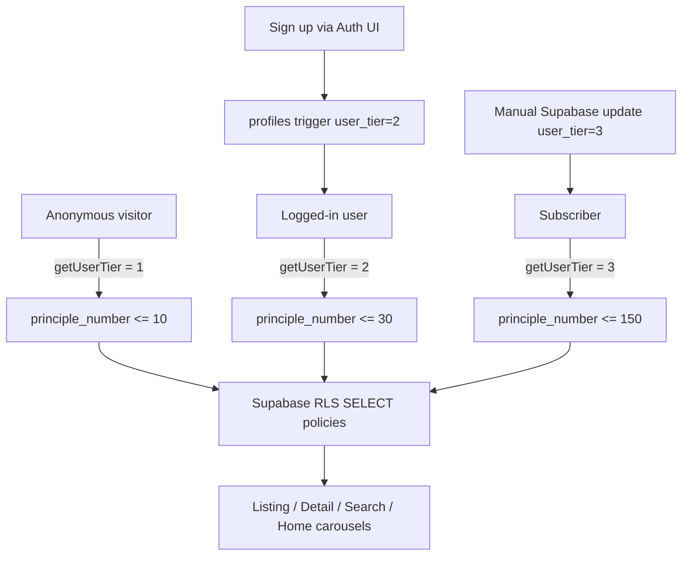

# Auth + 10/30/150 Tier Gating Plan

## v3 doc vs this project — what matches, what must change

### Already done (v3 Phase 3 is mostly obsolete here)

The v3 doc assumes mock data still needs wiring. **Your project already has real Supabase data** on:

- [`app/[locale]/principles/page.tsx`](app/[locale]/principles/page.tsx) — full catalog fetch
- [`app/[locale]/principles/[slug]/page.tsx`](app/[locale]/principles/[slug]/page.tsx) — full detail content
- [`app/[locale]/page.tsx`](app/[locale]/page.tsx) — A/B/C carousels via [`getPrinciplesForHomeSection`](lib/principles.ts)
- 150 PDFs seeded with `principle_number` 1–150

**Skip v3 Prompts 10–12 as written.** Instead, add tier filtering to the existing pages.

### Good alignment with v3 (keep as-is conceptually)

| v3 step | Fits this project? |
|---------|-------------------|
| P1 — `@supabase/auth-ui-react`, `@supabase/ssr`, browser + server clients | Yes — not installed yet |
| P2 — Login page with `<Auth />` component | Yes — style to existing Figma tokens |
| P3 — `app/auth/callback/route.ts` | Yes — keep outside `[locale]` |
| P4 — `profiles` table + trigger (`user_tier = 2` on signup) | Yes — table does not exist yet |
| P6 — Navbar Sign in / avatar / sign out | Yes — [`Navbar.tsx`](components/layout/Navbar.tsx) has no auth UI |
| P8 — `lib/access.ts` `getUserTier()` | Yes — central tier resolver |
| P9 — LockedSection + detail upgrade wall | Yes — new UI |
| P14–P16 — Security audit, prod Supabase, launch checklist | Yes — later phase |

### Required adaptations to v3

**1. Route structure — use `[locale]`, not `(en)`**

Project uses next-intl with [`app/[locale]/`](app/[locale]/layout.tsx) and locales `en` / `si` ([`i18n/routing.ts`](i18n/routing.ts)).

- Login page: `app/[locale]/login/page.tsx` (not `app/(en)/login`)
- Auth callback stays at `app/auth/callback/route.ts`
- Redirect after login: `/{locale}/principles` (use next-intl navigation)

**2. Keep `middleware.ts` — do not replace with `proxy.ts`**

v3 says Next.js 16 renamed middleware → `proxy.ts`. **This is not reflected in your installed Next 16.2.1** and would break next-intl.

Instead, **extend existing [`middleware.ts`](middleware.ts)** to:
1. Refresh Supabase session (`@supabase/ssr`)
2. Then run next-intl middleware (same matcher)

Reference pattern: [Supabase Next.js SSR middleware](https://supabase.com/docs/guides/auth/server-side/nextjs) chained with next-intl.

**3. Refactor Supabase clients (critical for security)**

Current setup bypasses RLS on reads:

```1:7:lib/supabase/server.ts
export { getSupabaseAdmin as getSupabaseServer } from "../supabase-admin";
```

Detail/list helpers in [`lib/principles.ts`](lib/principles.ts) use **service role** (`getSupabaseAdmin`), and RLS is wide open:

```sql
-- existing policy allows ALL rows to anon
using (true)
```

For tier gating to be real (not bypassable), you must:
- Add `@supabase/ssr` cookie-based clients: `lib/supabase/client.ts`, rewrite `lib/supabase/server.ts`
- Keep `getSupabaseAdmin()` only for seed scripts / server writes (newsletter, waitlist)
- Switch principle **reads** to the user-scoped server client so RLS applies
- Replace the open SELECT policy with tier-aware policies

**4. Use `principle_number` instead of a new `tier` column**

v3 adds `principles.tier` (1/2/3). You already have [`principle_number`](supabase/migrations/20260404120000_principles_principle_number.sql) assigned 1–150.

Recommended mapping (simpler, no extra column):

| Access level | Who | Max `principle_number` |
|-------------|-----|--------------------------|
| Tier 1 | Anonymous visitor | 10 |
| Tier 2 | Logged-in free account (`profiles.user_tier = 2`, default on signup) | 30 |
| Tier 3 | Manual subscriber (`profiles.user_tier = 3`, set in Supabase dashboard) | 150 |

`getUserTier()` returns `1 | 2 | 3`; a helper maps that to `10 | 30 | 150`.

**5. Tier 3 = manual upgrade (your choice)**

No admin panel, no Stripe yet. When someone subscribes offline, set `profiles.user_tier = 3` in Supabase. Stripe webhook can slot in later without changing the gating logic.

**6. Homepage featured section still hardcoded**

A/B/C carousels already use DB data, but the top “Featured skills” row in [`app/[locale]/page.tsx`](app/[locale]/page.tsx) is still 4 placeholder cards. Either wire to first N tier-visible principles or leave for a follow-up.

**7. Localization**

v3 says “English only.” Your app uses next-intl — add auth strings to existing message files (`messages/en.json`, `messages/si.json`) for Sign in, upgrade CTAs, etc.

**8. Tailwind version**

v3 references Tailwind 3.4; project uses **Tailwind 4**. Keep using existing design tokens in [`app/globals.css`](app/globals.css) / tailwind config — no downgrade.

---

## Architecture



---

## Implementation phases

### Phase 1 — Auth (Buildcamp pattern) — ~1 day

**Install packages**

```bash
pnpm add @supabase/ssr @supabase/auth-ui-react @supabase/auth-ui-shared
```

**New/updated files**

- `lib/supabase/client.ts` — `createBrowserClient`
- `lib/supabase/server.ts` — `createServerClient` with cookies (replace admin re-export)
- `lib/supabase/middleware.ts` — `updateSession` helper
- `middleware.ts` — chain Supabase session refresh + next-intl
- `app/[locale]/login/page.tsx` — `<Auth />` with appearance matching brand (cream/bg, accent `#B68973`)
- `app/auth/callback/route.ts` — exchange code for session, redirect to `/principles`
- Migration: `profiles` table + trigger on `auth.users` insert

**Profiles schema (migration)**

```sql
create table public.profiles (
  id uuid primary key references auth.users(id) on delete cascade,
  user_tier int not null default 2 check (user_tier in (2, 3)),
  created_at timestamptz not null default now()
);

-- trigger: on auth.users insert → profiles (user_tier = 2)
```

Note: anonymous users have no profile; tier 1 is computed in app code when no session exists.

**Navbar** ([`components/layout/Navbar.tsx`](components/layout/Navbar.tsx))

- Logged out: “Sign in” → `/login`
- Logged in: avatar + sign out (`supabase.auth.signOut()`)
- Read session server-side in a small server wrapper or pass user from layout

**Supabase dashboard config**

- Enable Email auth (or providers you want)
- Add redirect URLs: `http://localhost:3000/auth/callback`, production domain callback

---

### Phase 2 — Tier system — ~1 day

**Migration: RLS policies**

1. Drop `"Public can read principles" using (true)`
2. Add policies:

```sql
-- Anonymous: first 10 published principles
create policy "Public read tier 1 principles"
  on public.principles for select
  using (published = true and principle_number <= 10);

-- Authenticated: up to profile limit
create policy "Users read principles up to tier"
  on public.principles for select
  using (
    published = true
    and auth.uid() is not null
    and principle_number <= case (
      select user_tier from public.profiles where id = auth.uid()
    )
      when 3 then 150
      else 30
    end
  );
```

**`lib/access.ts`**

```ts
export type UserTier = 1 | 2 | 3;

export async function getUserTier(): Promise<UserTier> {
  // no session → 1
  // session + profiles.user_tier → 2 or 3
}

export function getPrincipleLimit(tier: UserTier): number {
  return tier === 1 ? 10 : tier === 2 ? 30 : 150;
}
```

**Update all read paths** (apply `.lte("principle_number", limit)` or rely on RLS via user-scoped client):

| File | Change |
|------|--------|
| [`lib/principles.ts`](lib/principles.ts) | Accept tier/limit; stop using admin client for reads |
| [`app/[locale]/principles/page.tsx`](app/[locale]/principles/page.tsx) | `getUserTier()` + filtered fetch; show “Showing X of 150” |
| [`app/[locale]/principles/[slug]/page.tsx`](app/[locale]/principles/[slug]/page.tsx) | Fetch slug; if `principle_number > limit`, render upgrade wall |
| [`app/api/search/route.ts`](app/api/search/route.ts) | Use server client with session cookies; RLS filters results |
| [`app/[locale]/page.tsx`](app/[locale]/page.tsx) | Filter home carousels by tier limit |

**New UI: `LockedSection`**

- Below last visible card on listing page
- 3 blurred placeholder cards (fake — never fetch locked data)
- CTA: anonymous → “Sign up free to unlock 30 principles” → `/login`
- Tier 2 user → “Contact us / subscribe to unlock all 150” (placeholder until payments)

**Detail upgrade wall**

- Show illustration + title + category (minimal fields OK to fetch, or use slug-only metadata)
- Blur/hide long-form sections when locked
- Same CTAs as above

---

### Phase 3 — Hardening + launch prep — ~2–3 days

- **Search**: confirm locked slugs never appear in dropdown for lower tiers
- **Direct URL test**: `/principles/some-tier-3-slug` as anonymous → upgrade wall, not full content
- **RLS audit**: query Supabase REST API with anon key as tier-2 principle_number 31 — must return empty
- **Service role audit**: ensure `SUPABASE_SERVICE_ROLE_KEY` is never in `NEXT_PUBLIC_*`
- **SEO**: dynamic `generateMetadata` on detail pages (partially exists); sitemap should only emit slugs the requester can access OR emit all slugs but pages show upgrade wall (pick one strategy)
- **Manual tier 3 workflow**: document how to set `profiles.user_tier = 3` in Supabase for early subscribers

---

## v3 prompts mapped to this repo

| v3 prompt | Action in this repo |
|-----------|---------------------|
| P1 Auth UI + clients | Do — adapt file paths |
| P2 Login page | Do — `app/[locale]/login/page.tsx` |
| P3 Callback | Do — unchanged |
| P4 Profile trigger | Do — new migration |
| P5 proxy.ts | **Replace with** extend `middleware.ts` |
| P6 Navbar auth | Do |
| P7 Tier migration | **Adapt** — use `principle_number` + RLS, not `principles.tier` column |
| P8 getUserTier | Do |
| P9 LockedSection | Do |
| P10–12 Real data | **Skip** — add tier filters to existing pages instead |
| P13–16 SEO/security/launch | Do in Phase 3 |

---

## Test checklist (from v3, adapted)

1. Incognito → see 10 principles on `/principles` and home carousels
2. Sign up → session persists → see 30 principles
3. Manually set `user_tier = 3` → see all 150
4. Sign out → back to 10
5. Click locked principle slug as anonymous → upgrade wall, no full article HTML
6. Search as anonymous → no results above principle 10
7. Test EN + SI locales on login and upgrade CTAs
8. Light/dark mode on new auth UI

---

## Key risk to watch

**Service-role reads today make tier gating cosmetic only.** Phase 1 client refactor + Phase 2 RLS are both required before this is production-safe. UI-only filtering without RLS changes would leak all 150 principles to anyone using the anon key directly.
