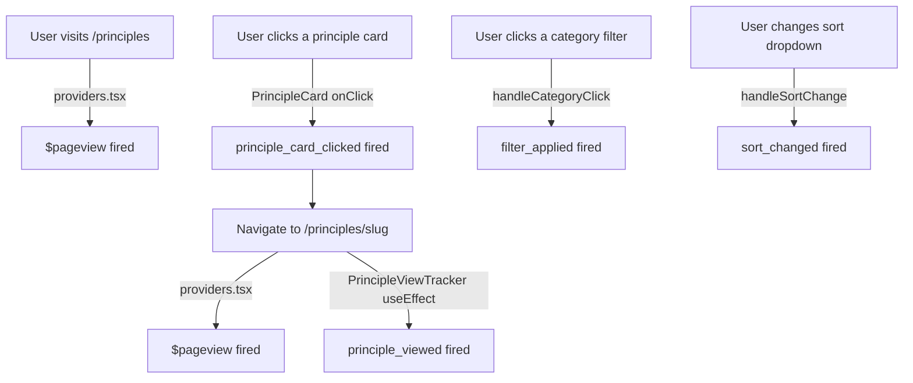

# Wire PostHog Analytics to UI Components

## The Core Problem

`lib/analytics.ts` has all the tracking functions, but **none are imported or called anywhere in the app**. The only events currently firing are:

- `$pageview` — auto-fired by `providers.tsx` on route change
- `$pageleave` — auto-fired by PostHog config
- Generic autocapture clicks (unstructured, not your custom events)

## What Needs to be Wired Up

### 1. `principle_card_clicked` — `[components/features/PrincipleCard.tsx](components/features/PrincipleCard.tsx)`

`PrincipleCard` is a server component using a plain `<Link>`. It needs an `onClick` handler, which requires `"use client"`. Add the directive and call `trackPrincipleCardClicked(slug, position, section)` on click.

The `position` and `section` props need to be passed down from `PrinciplesGrid`, which already maps over the principles array with an index.

### 2. `principle_viewed` — `[app/(en)/principles/[slug]/page.tsx](app/(en)`/principles/[slug]/page.tsx)

This is a **server component** — you can't call `posthog.capture` directly in it. The fix is to add a small `"use client"` child component (e.g. `PrincipleViewTracker`) that calls `trackPrincipleViewed(slug, category, locale)` inside a `useEffect` on mount. Drop it into the page JSX and it fires the event once when the page loads.

### 3. `filter_applied` — `[components/features/PrinciplesFilter.tsx](components/features/PrinciplesFilter.tsx)`

Already a `"use client"` component. Add `trackFilterApplied(filterType, value)` inside `handleCategoryClick`.

### 4. `sort_changed` — `[components/features/PrinciplesFilter.tsx](components/features/PrinciplesFilter.tsx)`

Same file. Add `trackSortChanged(sortValue)` inside `handleSortChange`.

## Event Flow After Wiring

## Verifying in PostHog Live Events

After deploying, go to **us.posthog.com → Activity → Live Events** and trigger:

- Visit `/principles` → see `$pageview` with `url: /principles`
- Click a category filter pill → see `filter_applied` with `filter_type: category`
- Change the sort dropdown → see `sort_changed` with `sort_value: a-z` (or whichever)
- Click a principle card → see `principle_card_clicked` then a new `$pageview`
- Wait 2 seconds on the detail page → see `principle_viewed` with `slug`, `category`, `locale`

